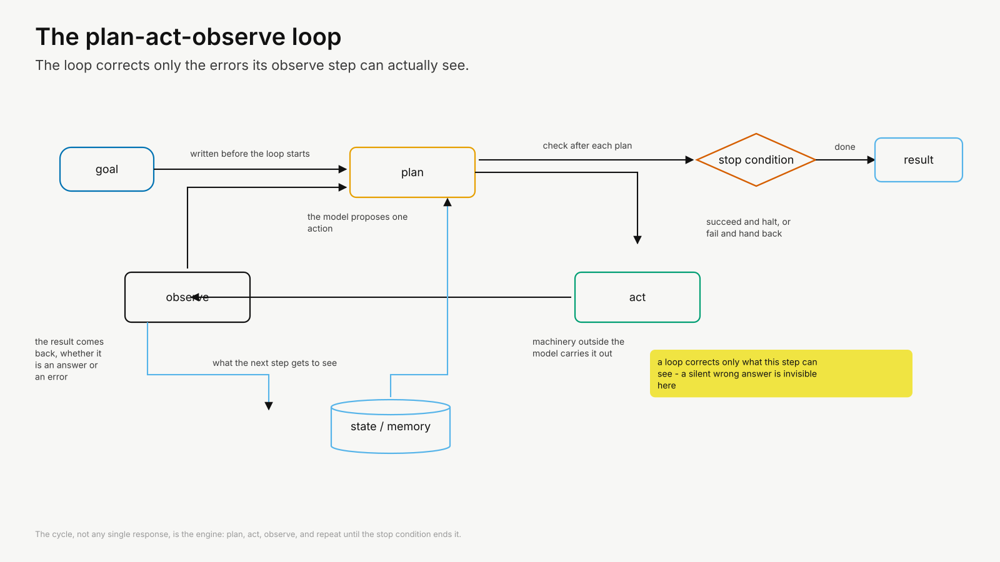

# Restructure proposal

**v0.1 · 27 July 2026 · ai-editor · PROPOSAL ONLY, nothing executed.**

This document proposes changes.
It does not make them.
No chapter file, no admin document and no DECIDED item has been altered.
Everything below waits on the author's decision.

Where a proposal would require changing a DECIDED item in `CLAUDE.md` or outline §9, it is marked **[DECIDED ITEM — needs your explicit instruction]**.

---

## Executive summary

Seventeen chapters is roughly the right number, but it is the wrong seventeen.
One chapter (Ch. 4, the scientist's stance) is section-sized rather than chapter-sized, and it duplicates Ch. 1 §1.4.
Fold it into Ch. 1.
That frees the number 4 for the material genuinely missing: a dedicated chapter on harness and loop engineering, placed after specification, as the last chapter of Part I.
Net count stays at 17, and Chapters 5 to 17 keep their numbers, so no downstream cross-reference or figure identifier moves.

Remove the eight repository-pointer sections and replace each with a short "Adapting the pattern" section.
Promote the eight verification checklists to a printed appendix, which is the honest version of a promise the parked repository was carrying.
Move all 51 figure briefs out of the chapters into `/figure-briefs`, leaving the image, the caption and the alt-text in place, because those three are published text and the brief is production material.

One thing you may not have priced.
The manuscript is 66,100 words of body prose against a 38,000 to 42,000 indicative budget, roughly 1.65 times over, and this restructure is the cheapest moment to decide whether that stands.

---

## What I read, and four measurements that shape everything below

Read in full: `CLAUDE.md`, `manuscript/OUTLINE.md` v0.5, `FIGURES.md` v2.0, `manuscript/ch02`, the relevant sections of `STYLE.md`, `REVISION-PLAN.md` §2 and `RESEARCH-INTEGRATION-PLAN.md` §§1–2.
Skimmed: every chapter file ch00 to ch17, by headings, status headers, opening sections, all eight repository-pointer sections, all 51 captions, and the sections named in the analysis below.
Listed: `/research` (three reports) and the figure directories.

Four measurements matter, and each is checkable.

**Measurement 1 — length.**
The eighteen chapter files hold 109,743 words.
Of those, 33,139 sit inside fenced `FIGURE BRIEF` blocks, 6,298 are alt-text, 3,795 are captions and 414 are figure heading lines.
Body prose is therefore **66,097 words** against an indicative budget of 38,000 to 42,000.
That is 1.65 times the midpoint.
At roughly 350 words a page, plus 51 figures and front and back matter, the book is currently around 210 to 220 pages, not 150.

**Measurement 2 — the directories in the admin documents do not exist.**
`CLAUDE.md` and outline §8 both name `/figures-source` for briefs and alt-text.
There is no such directory.
What exists is `/figures` (51 rendered SVGs) and `/figures-src` (10 Python renderer scripts).
Neither is named in either document.

**Measurement 3 — figure identifiers are contained within chapters.**
No chapter references another chapter's figure.
The single cross-file reference is ch00 referring to its own Figure 0.1.
A chapter merge therefore forces renumbering only inside the merged chapters, and never anywhere else.

**Measurement 4 — the admin documents are two passes stale, and contradict each other.**
`CLAUDE.md` says `FIGURES.md` is v1.0; it is v2.0, dated 26 July.
`CLAUDE.md` says figure captions and alt-text "have not yet been converted" to the v5.0 colloquial register.
I read all 51 captions.
They are in the colloquial register ("Two stores, one of which forgets", "Nothing about 42 looks wrong", "The line that decides what an attack can accomplish").
`FIGURES.md` v2.0 §6.1 and §6.2 already mandate that register.
The pending pass you were told about appears to have happened.
Separately, outline §9 says revision pass R1 is "under way".
R1 is closed and R2 has been executed, on the evidence of the post-execution reviewer notes in `RESEARCH-INTEGRATION-PLAN.md`.
The outline is the document declared authoritative, and it describes a project state two passes old.

---

## 1. Are 17 chapters too many?

### The honest answer

No, not by count.
Seventeen chapters across 150 pages is about nine pages each, which is a normal shape for a practitioner handbook and suits a reader who will use the book by chapter rather than read it straight through.
The problem is not how many chapters there are.
The problem is that two of them are not chapter-sized and one subject that deserves a chapter does not have one.

Here is the body-prose distribution, which is what the argument rests on.

| Ch. | Subject | Body prose (words) | Against the 3,900 average |
|---|---|---|---|
| 1 | Why agents, why now | 3,474 | 0.89× |
| 2 | Anatomy of an agent | 4,238 | 1.09× |
| 3 | Specifying work for agents | 3,799 | 0.97× |
| **4** | **The scientist's stance** | **1,629** | **0.42×** |
| 5 | Evidence and literature synthesis | 4,151 | 1.06× |
| 6 | Data acquisition and quality control | 3,507 | 0.90× |
| 7 | Coding and pipeline agents | 5,086 | 1.30× |
| 8 | Model orchestration and experimentation | 4,510 | 1.16× |
| 9 | From results to manuscript | 4,703 | 1.21× |
| 10 | Multi-agent workflows | 5,278 | 1.35× |
| 11 | Verification and evaluation | 7,761 | 1.99× |
| 12 | Provenance, governance and security | 6,423 | 1.65× |
| 13 | The failure gallery | 5,892 | 1.51× |
| 14 | Verification under constraint | 4,730 | 1.21× |
| 15 | Governing a modelling workflow | 3,980 | 1.02× |
| 16 | Starting in your own group | 3,956 | 1.01× |
| **17** | **What will last** | **2,043** | **0.52×** |

(Figures are body prose only, with figure briefs, captions and alt-text excluded, so chapters with many figures are not flattered.)

Thirteen of the seventeen sit between 0.89 and 1.35 times the average.
That is a well-proportioned book.
The outliers are Ch. 4 and Ch. 17 at the bottom, and Ch. 11 at the top.

### Merge 1 — Ch. 4 into Ch. 1. Clean win, recommended.

Ch. 4 is the smallest chapter in the book at 1,629 words, and it duplicates Ch. 1.

Compare the two directly.
Ch. 1 §1.4 closes with this.

> "Past the merely unreliable is a third category that has nothing to do with capability … accountability, scientific judgement, and authorship. An agent cannot be responsible for a flood warning, cannot decide that an anomaly is real rather than an artefact, and cannot be an author of the paper that follows. None of these limits softens as models improve."

Ch. 4 §4.4 opens with this.

> "Three things in scientific work never transfer to a tool, however good the tool gets. Accountability … Interpretation … Authorship … No better model closes these limits, because none of them is a shortfall in capability."

That is the same claim, twice, forty pages apart, in a book where de-duplication to one canonical home is DECIDED.
There is a second duplication: Ch. 4 §4.2 cites Kapoor et al. (2024) for the finding that a plain model in a retry loop matches elaborate architectures, and Ch. 10 §10.1 cites the same paper for the same finding.

There is also an ordering fault.
Ch. 4 answers "should you delegate this at all", and it currently sits after Ch. 3, which answers "how do you specify what you delegate".
The "whether" question belongs before the "how" question.
`ch00` tells the reader "If you want to start doing the work, begin at Chapter 3", which sends a reader straight past the stance chapter and then back into it.

**Proposal.**
Merge Ch. 4 into Ch. 1 to make **Ch. 1 — Why agents, why now, and where they don't belong**, at roughly 4,600 words after de-duplication.
Ch. 4 §4.4 is deleted and its content is already in Ch. 1 §1.4, which absorbs any sharper phrasing.
Ch. 4 §4.1 (where an agent fits the scientific method) and §4.2 (augmentation and automation) become new Ch. 1 sections.
Ch. 4 §4.3 (the decision procedure) survives intact, with **Figure 4.1 becoming Figure 1.3**.
That flowchart is one of the most usable figures in the book and nothing about the merge threatens it.
The Kapoor citation is kept in Ch. 10 only, with a pointer from Ch. 1.

**Cost.** Ten "Chapter 4" cross-references across ch01, ch03, ch04, ch10, ch11 and ch17. One SVG renamed. One entry moved in `figures-src/f_ch00_01.py`. Ch. 1 §1.5 and ch00's "How to read this book" both rewritten, because both hard-code the chapter map.

### Merge 2 — Ch. 17 into Ch. 16. Defensible, offered as an option, not recommended.

Ch. 17 is 2,043 words and about to get smaller.
Its §17.4 is titled "The repository as the living layer", and point 3 below removes most of what that section promises.
After that removal, Ch. 17 is around 1,500 words, which is smaller than the Ch. 4 you would just have merged away for being too small.
Consistency says treat them the same.

The counter-argument is real.
A book needs an ending, and Ch. 17's job is rhetorical as well as informational.
Merging it into a practical thirty-day plan puts a reflective closing argument inside a chapter about what to do on day nine, and weakens both.

**Proposal.**
Keep Ch. 17 as a separate closing chapter, rewritten around a narrower claim (see point 3), and accept that it is short.
A five-page closing chapter is a normal thing for a book to have, in a way that a five-page chapter in the middle of Part I is not.

**If you want a leaner book**, merge it, producing **Ch. 16 — Starting, and staying current**, and reduce Part V to a single chapter.
That saves about four pages and takes the count to 16.
I would take this only if you also decide to cut length overall, in which case it is consistent with that decision rather than a change on its own.

### Merges I considered and reject

**Ch. 14 and Ch. 15 into one case-study chapter.**
Forced.
They are different studies with different lessons: data sovereignty under constraint, and end-to-end governance of a modelling workflow.
Fusing them would produce a chapter with two unrelated halves and no argument connecting them.
Part IV's two chapters are also the evidence base for the positioning claim that this book is grounded in executed work, and presenting them as one study weakens that.

**Ch. 5 and Ch. 9 (the two text-facing patterns).**
Forced.
One is the input side of scholarship and one is the output side, and they are separated by the whole research lifecycle that Part II is organised around.
Merging them breaks the lifecycle ordering that gives Part II its shape.

**Ch. 6 and Ch. 7 (data and code).**
Forced.
"Agents propose, QC rules dispose" and "successive gates, human at the end" are two different governance patterns, and the book's whole method is to teach patterns one at a time with an identical anatomy.

**Ch. 10 into Ch. 15.**
Forced.
Ch. 10 is the pattern and Ch. 15 is one executed instance of it.
The book is careful, correctly, not to present designed work as executed work, and this merge would blur exactly that line.

**Ch. 13 into Ch. 11.**
Forced, and expensive.
The failure gallery is the canonical home for failure anatomy under the de-duplication rule, and every pattern chapter cross-references it.
It is also structurally different, being organised as failure and check pairs rather than as an argument.

**Splitting Ch. 12 into governance and security.**
This is the one case where the material argues for *more* chapters, not fewer.
Ch. 12 is 6,423 words across eleven sections covering three subjects.
I am not proposing it, because you asked about consolidation and because the two halves genuinely do share the claim that behaviour must be bounded, recorded and accountable.
Recording it here so the option is on file.

### Target chapter count

**Recommended: 17.**
One merged out (old Ch. 4), one added (harness and loop engineering, new Ch. 4).
Chapters 5 to 17 keep their numbers, their filenames and their figure identifiers.

**Leaner variant: 16.**
As above, plus Ch. 17 merged into Ch. 16.
Take this only alongside a decision to cut overall length.

**Below 16 requires merges I would argue against**, for the reasons given above.
If you want fewer chapters than 16, the honest route is not merging but cutting, which is the length question in point 5.

---

## 2. Harness and loop engineering

### The gap is real, and the book already admits it

Ch. 2 §2.1 says this, in the draft as it stands.

> "one strand of practitioner commentary calls the whole assembly around the model the harness, and argues that the harness, more than the model at its centre, decides what an agent can actually do"

The book states that the harness decides what an agent can do, and then never says how to build one.
Ch. 2 is explicit that this is deliberate: "The purpose is diagnostic rather than architectural."
That was a reasonable choice for Ch. 2 and it leaves a gap nothing else fills.

Ch. 2 §2.4 makes a second promise it does not keep.

> "this curation is itself a design task with no sensible default."

Naming a design task with no sensible default, and then supplying no guidance on it, is the clearest statement of the gap I found.

### What "harness" and "loop" mean for this audience, vendor-neutrally

For a practising environmental scientist, the useful distinction is between the cycle and everything around the cycle.

**The loop** is the plan, act and observe cycle of Ch. 2 §2.2, plus the rules that govern how it runs and when it stops.
The engineering decisions are: what counts as done, what counts as failed, how many steps and tokens the run may consume, what happens when it makes no progress, which errors are worth retrying and how, and what a tool hands back when it fails.
The book currently covers the cycle and one clause of the stop condition, inside a figure.

**The harness** is everything the loop runs inside.
The engineering decisions are: which tools exist and how they are named and scoped, what enters the context window at each step and what gets summarised out of it, what state persists between steps and between runs, what the run writes to a log so a person can diagnose it afterwards, where the run pauses for a human, what the execution environment can reach, and what caps bound cost and wall-clock time.

Both are pattern-level and outlast any product, which is exactly the standard the book applies everywhere else.
A scientist reading this chapter should come away able to say, of their own workflow: this run stops after N steps or when the acceptance criterion is met, whichever comes first; these six tools and no others; this goes in the context every step and this is retrieved on demand; this is logged; a person approves here and nowhere else.

### Where it should land: a dedicated chapter, and pointers, not distribution

Distributing this material across existing chapters reproduces exactly the scattering that made it invisible.
Ch. 2 has the loop, Ch. 3 has stop conditions as a specification field, Ch. 7 has a gate stack for coding, Ch. 12 has permission scoping as a security control, Ch. 16 has cost.
Every piece is somewhere and the design problem is nowhere.
The de-duplication rule points the same way: one canonical home.

**Proposal: a new Ch. 4 — The harness: engineering the loop.**
Part I, after Ch. 3 (specification), before Part II.

Placing it after specification rather than before is deliberate.
The chapter's material enforces things the specification declares.
Stop conditions, acceptance criteria and the named reviewer are Ch. 3 fields, and the harness chapter is where they become machinery.
Putting it before Ch. 3 would demote specification from the "begin here" position `ch00` gives it, and would leave the harness chapter enforcing fields the reader has not met.

### Chapter brief (written so ai-writer can execute it and ai-reviewer can review against it)

**Objective.** Give the reader the design decisions that determine whether an agent finishes correctly, cheaply and inspectably, at the level of durable pattern rather than named tool.

**Scope boundary.** This chapter is about the machinery around one agent. Composition of several agents stays in Ch. 2 §2.5 and Ch. 10. Whether the gates work stays in Ch. 11. Why the record must exist stays in Ch. 12.

**Anatomy.** Part I chapter, so the Part II anatomy does not bind. Proposed sections:

- **4.1 The harness is the part you actually build.** Opens on a concrete case, per STYLE.md. `[AUTHOR: …]` for a harness from your own operational work: the tools it held, what stopped it, what it logged.
- **4.2 Loop control: what stops a run.** Success, failure, budget exhaustion, no-progress detection, escalation to a human. Each named as a distinct termination condition with a default. Step and token budgets and what happens when they run out.
- **4.3 Retry, backoff and the error surface.** Which errors are worth retrying, what changes between attempts, why retrying an unchanged plan amplifies a wrong one. How to design what a tool returns so the observe step is informative. Extends Ch. 2 §2.2's claim that a silent wrong answer defeats the loop, into guidance on preventing it.
- **4.4 The tool surface.** How many tools, at what granularity, named how, with what argument schemas. Why fewer is usually better. Removal as a maintenance action.
- **4.5 Context assembly and compaction.** What is resident every step, what is retrieved on demand, what is summarised away and what that loses. Delegation to a sub-agent as a context decision, pointing to Ch. 2 §2.5 rather than re-deriving it.
- **4.6 State, logging and the run record.** Scratch state, run directories, per-step logs. Explicit distinction from Ch. 12: this record exists so you can diagnose a run, the Ch. 12 record exists so someone else can hold you to account. Different purposes, different retention, one pointer each way.
- **4.7 Where a human interrupts.** In the loop against over the loop. Batching approvals. Pause points chosen by consequence rather than by capability, pointing to Ch. 12 §12.8 for the permission argument rather than restating it.
- **4.8 Cost and latency controls.** Caps, cheaper models for cheap steps, parallelism, wall-clock budgets for operational deadlines. Points back to Ch. 2 §2.6 for the accounting and forward to Ch. 16 for the group-level cost model.
- **4.9 Maintaining a harness.** A harness built around a weaker model's limitations, and what happens when the model improves. Scheduled reappraisal rather than one-off design.

**Figures (4).** 4.1 architecture, the whole harness with every control point annotated. 4.2 decision flowchart, termination and retry logic. 4.3 sequence, one governed run from goal to result with budgets and interrupts marked. 4.4 before/after, a naive loop and an engineered one on the same task. This matches the standard Part II set for type balance.

**Target.** 3,500 to 4,000 words body prose, roughly 9 to 10 indicative pages.

**Acceptance criteria (for ai-reviewer).**
1. Every section names at least one decision the reader makes, and states a default.
2. No named product anywhere in prose.
3. Every substantive claim is either cited from `/research`, marked `[verify]`, or flagged as the book's own judgement with a confidence flag.
4. No re-derivation of Ch. 2's anatomy, Ch. 3's specification fields, Ch. 11's gate measurement or Ch. 12's least-privilege argument. Pointers only.
5. At least one `[AUTHOR: …]` marker for a harness from executed operational work.
6. The chapter can be read by someone who has not read Part II, and Part II chapters can point to it without needing to explain it again.

### What it displaces

The de-duplication rule is DECIDED, so every one of these is a required cut, not an optional one.

| Where | What moves or goes | Approx. words | Ruling |
|---|---|---|---|
| Ch. 2 §2.4, third paragraph | "treat context as a scarce, curated resource" guidance | ~120 | Compress to a pointer. The mechanism (finite, ordered, lossy) stays in Ch. 2; the design guidance moves to Ch. 4. |
| Ch. 2 §2.6 | Cost *controls* | ~80 | Controls move to Ch. 4 §4.8. The accounting and the "verification dominates cost" argument stay in Ch. 2. That argument is one the whole book rests on and must not move. |
| Ch. 2 §2.2 | Stop-condition material | 0 | Stays. Ch. 2 names the condition, Ch. 4 designs it. Ch. 4 must not restate the loop. |
| Ch. 3 §3.3 | Stop conditions as a specification field | 0 | Stays. Clean line: Ch. 3 is what you write down, Ch. 4 is what enforces it. |
| Ch. 7 §7.3 | The four-gate stack | 0 | Stays. It is the coding instance of a general pattern. Add one sentence pointing to Ch. 4 for the general form. |
| Ch. 12 §12.8 | Least privilege and the trust boundary | 0 | **Stays in Ch. 12.** Ch. 4 treats permission scope as a harness parameter and points. Ch. 12 needs it in place for the institutional-IT argument and Figure 12.2. |
| Ch. 10 §10.1 | Kapoor et al. retry-loop finding | 0 | Stays. Ch. 4 may point to it; it must not be cited twice more. |

Total displaced prose: about 200 words. The new chapter is therefore close to net-new length, which matters for point 5.

### The blocking constraint: research coverage

I checked the three reports in `/research` for harness and loop material.
Coverage is thin and mostly grey literature.

What exists: seventeen mentions of "harness" in the practitioner-video report, chiefly Nate Jones on harness maintenance, world drift, harness co-evolution and "pruning beats piling"; Gaito's independent corroboration of the same concept; Mehta (2026) on silent semantic failures, which supports §4.3; Wang et al. (2026) on benchmark auditing; ReAct and stop conditions in the foundations sweep.

What does not exist: any substantial peer-reviewed or preprint coverage of tool-surface design, context compaction policy, retry and backoff for agents, step budgeting, or observability for agent runs.

That matters because of two binding rules.
Citations come from `/research` only.
And the R2 video policy, which you approved, limits video citations to one per chapter across seven named chapters, and states that video-derived concepts are corroborating colour and never primary evidence.
A new Ch. 4 is not among those seven.

**Consequence.** A harness chapter drafted today would rest on grey literature and the book's own judgement, which is thinner support than any other chapter in Part I.
**A targeted research sweep is a precondition, not a nicety.**
It can start immediately and run in parallel with everything else.

---

## 3. Removing the companion-repository promises

### Full inventory

**A. The eight repository-pointer sections. 1,489 words.**

| File | Section | Words |
|---|---|---|
| ch05 | §5.7 Repository pointer | 194 |
| ch06 | §6.7 Repository pointer | 167 |
| ch07 | §7.7 Repository pointer | 177 |
| ch08 | §8.8 Repository pointer | 182 |
| ch09 | §9.8 Repository pointer | 183 |
| ch10 | §10.8 Repository pointer | 330 |
| ch11 | §11.9 Repository pointer | 138 |
| ch12 | §12.11 Repository pointer | 118 |

**B. Named directory promises, inside and outside those sections.**

- ch05 §5.7: `/patterns/ch05-literature-synthesis`, runnable synthesis workflow, citation-verification gate as a separate script.
- ch06 §6.7: `/patterns/ch06-data-qc` end-to-end example, `/prompts`, `/checklists`.
- ch07 §7.7: `/patterns/ch07-coding-and-pipeline-agents`, and `/exercises` ("The exercises for this chapter, in `/exercises`, ask you to take one of your own run-once notebooks through the four gates"). Also carries `**[verify: confirm repository layout and exercise set before release.]**`.
- ch08 §8.7 (outside the pointer section): "Its printable form lives in the repository alongside the pattern."
- ch08 §8.8: `/patterns`, `/case-studies` (the three-track design as a sanitised case study), `/checklists`, `/prompts`.
- ch09 §9.8: artefact-linked manuscript example, `/checklists`.
- ch10 §10.8: `/patterns` roster skeleton, `/prompts` derivation template, `/checklists`, `/case-studies` ("will be deposited under `/case-studies` once that chapter's material is sanitised").
- ch11 §11.9: `/patterns/ch11-verification-and-evaluation`, evaluation-set template, seeded-defect harness.
- ch12 §12.11: `/patterns/ch12-provenance-governance-and-security`.

**C. Living-layer claims. These are a different kind of promise and need a different fix.**

- ch00, "How to read this book": "The companion repository holds everything that dates quickly: named tools, exact model versions, volatile figures, runnable examples and printable checklists."
- ch01 §1.4 closing: "the print holds the position and the reasoning, the companion repository tracks the movement".
- ch02 §2.6 closing, plus the `[AUTHOR: …]` marker after it (keep the marker, change the instruction inside it).
- ch09 header line, §9.4 twice: journal and funder policy specifics "held in the repository, not fixed in print".
- ch14 §14.7: methods and score definitions.
- ch16 header line, §16.1, §16.3, §16.6: volatile cost and energy figures.
- ch17 §17.1 twice, Figure 17.1 (caption, standfirst, on-canvas labels, alt-text and the whole brief), and **§17.4 "The repository as the living layer" in its entirety**.
- `FURTHER-READING.md`: `[AUTHOR: decide whether this gaps section belongs in the printed back matter or only in the repository]`.

**D. Admin documents.**

- `CLAUDE.md`: repository-layout line; the vendor-neutral rule, which routes named products to `/patterns` and `/prompts`; the DECIDED item "exercises live in `/exercises`, not the page budget"; the Parked item.
- `OUTLINE.md`: §3 "Runnable examples" bullet; §6 anatomy ending in "repository pointer (runnable example and optional exercises)"; §8 unified repository sketch; §9 DECIDED "exercises to the repository"; §9 DECIDED on the anatomy binding Part II "with Ch. 11 and Ch. 12 still owing … repository pointers"; §9 Parked item.
- `REVISION-PLAN.md` and `RESEARCH-INTEGRATION-PLAN.md`: both closed. Annotate as historical rather than edit.

**Scale.** Eight sections deleted, about twenty-five further sentences reworked, one whole section rewritten, one figure reworked including its rendered SVG, four admin documents amended.

### The problem this exposes, which is larger than the deletion

Category C is not the same as categories A and B, and it is worth separating clearly.

Categories A and B promise runnable code, prompts, printable checklists, sanitised configurations and exercises.
Those are parked, so the promises go.

Category C promises something else: that current model names, per-token prices, journal policy wording and energy figures live in the repository and are kept current there.
Nothing in the repository holds any of that today, and the parked build-out was never going to supply it either.
So category C is an unbacked promise even after the runnable examples are removed.

This matters because Ch. 17 §17.1 calls the print and repository division "this book's central wager about how to write usefully for practitioners".
If the repository holds no current values, that claim is unsupported, and the book closes on something a reader can check and find untrue.

**Proposal: narrow the living layer to what will actually exist, rather than delete it.**
At release the repository holds: the full Markdown source; the dated verified research reports in `/research`; the annotated further reading; the figure briefs; and an errata and update note per release.
That is a genuine living layer with no code in it, and the newsletter remains the announcement channel, which is already DECIDED.

Rewrites that follow:

- **ch00**: promise the source, the dated research sweeps, the further reading and per-release errata. Delete "runnable examples and printable checklists".
- **ch17 §17.4**: keep the two-layers argument, which is sound. Replace the mechanism. The repository absorbs change by carrying dated sweeps and errata, not by maintaining a price table.
- **ch09 §9.4**: this one changes substantively. Replace "current specifics are held in the repository" with an instruction the reader can act on: check the journal's own current policy page before submission, and here is what the classes tell you to look for. That is more useful than the promise it replaces.
- **ch02 §2.6, ch16 §16.3 and §16.6**: state that the figures move and why, state the reasoning that survives, and name where a reader looks it up. Do not promise a maintained table.
- **ch01 §1.4**: "the print holds the position and the reasoning" survives; the clause about the repository tracking the movement narrows.

### What replaces the closing section of the Part II anatomy

Deleting the seventh section leaves the anatomy with six, and each Part II chapter ending on a checklist.
That is not terrible.
It is also not what the anatomy was doing, which was to hand the reader something to take away and to say honestly which parts of the chapter would date.

**Proposal: a new closing section, "Adapting the pattern", 150 to 250 words.**
Two parts, both short.
First, the two or three decisions a reader must make to apply this pattern in their own setting, stated as decisions rather than instructions.
Second, one sentence naming what in the chapter will date and how to check it.

This keeps the anatomy at seven sections, keeps the volatility disclosure that the repository pointer was carrying, gives the reader a genuine takeaway, and promises nothing that does not exist.
Net length change is close to zero: 1,489 words out, about 1,600 in.

Alternatives I considered.
Ending on the checklist and having six sections is clean and I would accept it if you prefer less new writing.
A "try this" section resurrects exercises, which are parked, so no.

### The checklists deserve to be in the book

The eight verification checklists (Ch. 5 to Ch. 12) are the most obviously reusable thing in the manuscript, and `/checklists` was the only place their printable form was ever promised.

**Proposal: Appendix A — Verification checklists.**
All eight collected in one place, in the standard format already defined in `REVISION-PLAN.md` §2.2, cross-referenced from each chapter as "the printable form is Appendix A".
This is assembly rather than new writing, because the checklists already exist and are already in the standard format.
Cost is about four to six pages, and it converts a parked promise into a delivered one.
I recommend this without reservation.

**Proposal: Appendix B — The specification schema.**
Ch. 3's seven fields as a blank template a reader can copy.
One to two pages.
It is the other artefact readers will want to lift out of the book, and Ch. 10 and Ch. 15 both depend on it, so a reader flipping between those chapters currently has to go back to Ch. 3 to find it.
Recommended, but weaker than Appendix A.

### What CLAUDE.md and the decision log must say instead

**Repository layout.** Replace the current line with the directories that will exist:

`/manuscript` (Markdown source; `OUTLINE.md`; `GLOSSARY.md`; `FURTHER-READING.md`; `ch00`–`ch17`; appendices) · `/research` (verified research reports; the sole source of manuscript citations) · `/figure-briefs` (one brief per figure) · `/figures` (rendered SVGs) · `/figures-src` (renderer scripts).

Note that this also fixes measurement 2: the current line names `/figures-source`, which does not exist, and omits `/figures` and `/figures-src`, which do.

**Vendor-neutral rule.** Currently routes named products and volatile figures to "`/patterns`, `/prompts` and repository docs". Those directories are going. Rewrite to: capability classes and approximate years in print; named products and volatile figures do not appear in the book at all, and where a reader needs a current value the text says where to look it up.

**Decision log.** Three changes, all needing your instruction.

- **[DECIDED ITEM — needs your explicit instruction]** "exercises live in `/exercises`, not the page budget" must move from Decided to a statement that exercises are not in this release at all. This is a reversal, not a clarification.
- **[DECIDED ITEM — needs your explicit instruction]** "full chapter anatomy binds Part II only, with Ch. 11 and Ch. 12 still owing verification checklists and repository pointers" must lose the repository-pointer half and gain the replacement section.
- **[DECIDED ITEM — needs your explicit instruction]** "unified repository with newsletter as update channel" is not reversed, but what the repository contains must be stated, because the book currently tells readers it contains things it will not.

The Parked item on the companion-repository build-out stays parked and gains one clause: the manuscript no longer refers to it, so unparking it later is additive rather than a correction.

---

## 4. Moving figure material out of the chapters

### What is inside chapter files today

51 figure briefs, 33,139 words, **30 per cent of all chapter-file text**.
Distribution: ch00 1, ch01 2, ch02 3, ch03 2, ch04 1, ch05 3, ch06 4, ch07 4, ch08 4, ch09 4, ch10 4, ch11 3, ch12 2, ch13 6, ch14 3, ch15 2, ch16 2, ch17 1.

Each figure occupies four elements in the chapter file, in this order:

1. A bold heading line, for example `**Figure 2.1 — The plan–act–observe loop.**`
2. A Markdown image whose alt attribute carries the full alt-text, pointing at `../figures/figure-2-1.svg`
3. An italic caption paragraph ending `(Rendered as \`figures/figure-2-1.svg\` from the brief below, per \`FIGURES.md\`.)`
4. A fenced block holding the complete `FIGURE BRIEF`, including its own `caption:` and `alt-text:` fields

Elements 2 and 3 duplicate fields inside element 4.
Every caption and every alt-text therefore exists twice in the same file, and the two copies can drift.
Ch. 17 also has an inconsistency: line 484 carries a bold heading whose wording does not match its own caption.

### The governing principle

**Published text stays in the chapter. Production specification moves out.**

Captions and alt-text are published text.
They appear in the book, they are read by readers, they are bound by `STYLE.md` and reviewable by ai-reviewer as prose.
The brief is production material.
It is a specification for whoever renders the figure and it never appears in the book.

That cut is clean, and it answers the author's question directly.
A bare placeholder line is the wrong choice: a chapter reading `[FIG 2.1]` cannot be read as a book, ai-reviewer cannot check the caption's register, and you cannot read your own manuscript in the source.
A figure identifier and caption without alt-text is also wrong, because alt-text is published text under the accessibility commitment in `FIGURES.md` §6.2.

### The mechanism

**Stays in the chapter**, three elements, in this exact form:

```


*Figure 2.1 — Caption, in the colloquial register, two or three sentences.*

<!-- brief: figure-briefs/figure-2-1.md -->
```

Changes from today: the bold heading line goes, being redundant with the caption; the "(Rendered as … from the brief below …)" pointer leaves the caption, because the brief is no longer below and production metadata does not belong inside published prose; an HTML comment carries the pointer instead, which is invisible in any rendering and findable by any agent.

**Moves out**: one file per figure at `figure-briefs/figure-2-1.md`, holding the complete brief per `FIGURES.md` §6, including its `caption:` and `alt-text:` fields.

**Naming.** `figure-briefs/figure-2-1.md` ↔ `figures/figure-2-1.svg` ↔ its entry in `figures-src/f_ch02_04.py`. One convention, three directories, mechanically checkable.

**On the directory name.** Do not call it `/figures-source`.
There is already a `/figures-src`, and two directories differing by four characters, one holding briefs and one holding Python, will be confused repeatedly by every future agent and by you.
`/figure-briefs` says what it holds.

### How numbering and cross-references survive

They survive because nothing about them changes.

- Figure identifiers stay `chapter.figure` and are untouched by the move.
- SVG filenames are untouched.
- The chapter keeps the image reference and the caption, so in-text mentions of "Figure 12.2" still resolve.
- **Measurement 3 applies**: no chapter references another chapter's figure, so no cross-file reference can break.

The only renumbering anywhere in this proposal comes from the Ch. 4 merge: Figure 4.1 becomes Figure 1.3, one SVG is renamed, one brief file is renamed, and one entry moves in `figures-src/f_ch00_01.py`.

### The caption and alt-text duplication

After the move, caption and alt-text still exist in two places: the chapter, and the brief file.
That duplication is worth keeping, because `CLAUDE.md` makes alt-text written at figure creation a hard rule, and creation happens in the brief.

**`FIGURES.md` must therefore state a precedence rule: the chapter file is authoritative for caption and alt-text. If the two differ, the chapter wins and the brief is corrected.**
Without that rule, an agent finding a discrepancy has no basis for deciding which to fix.

### What FIGURES.md must say

Four amendments, taking it to v2.1.

1. **New §6.0, "Where figure material lives".** The three directories, the naming convention, the exact three-element chapter block quoted verbatim, and the precedence rule.
2. **§6.1 amended.** The caption no longer ends with the render pointer. Give the HTML comment form instead.
3. **§6 preamble amended.** State that a brief is one file, not a fenced block inside a chapter.
4. **§7 amended.** Quality control reads the brief from `figure-briefs/`, and the fifth check becomes "the chapter's caption and alt-text match the brief's".

### The pending caption and alt-text style pass

`CLAUDE.md` says this pass is outstanding.
I read all 51 captions and the evidence says it is done.
They are colloquial, they open on content, they do not announce what the figure is about to do, and they carry the standfirst claim rather than restating the title.
`FIGURES.md` v2.0, dated 26 July, already mandates that register in §6.1 and §6.2, and the caption text matches it.

**Proposal.**
Do not schedule a conversion pass.
Instead, fold a **verification** pass into the extraction work, since every figure file is being opened anyway.
Check each caption and alt-text against `STYLE.md` §7, correct the few that fail, and then correct `CLAUDE.md`'s current-state paragraph, which is what is actually wrong here.
This is a much smaller job than the one you were expecting, and finding that out is worth the check.

---

## 5. What else the structure gets wrong

Ranked by importance. Nothing here is filler.

### 5.1 The book is 1.65 times its length budget, and this is the cheapest moment to decide

66,097 words of body prose against 38,000 to 42,000 indicative.
That is roughly 210 to 220 pages against a 150-page target, once figures and matter are counted.

"Overall length reduction" is Deferred, and I am not proposing to change that without instruction.
But the deferral interacts with every decision in this document, and the interaction runs the wrong way.
A merge saves almost nothing, because merging removes chapter overheads and duplicated claims, worth perhaps 1,500 words in the Ch. 4 case.
The new harness chapter adds 3,500 to 4,000.
Appendix A adds four to six pages.
The repository work is roughly length-neutral.
So this restructure, executed in full, makes the book slightly longer.

**Recommendation.** Un-defer the length question now and set a target before any of this is executed, because the decision changes what gets written.
Three positions, and I recommend the second.

- **Hold at 150 pages.** Requires cutting roughly 25,000 words, which is a larger job than everything else in this document combined. It would mean losing whole sections, not trimming sentences.
- **Restate the budget at what the book actually is,** around 200 to 210 pages, and cut only where a chapter is genuinely padded. Ch. 11 at 7,761 words and Ch. 12 at 6,423 are the obvious places to look. This is honest, it keeps the material you have already paid for, and 200 pages is not an unreasonable practitioner book.
- **Split into two releases.** Parts I to III as v1.0, Parts IV and V later. I mention it because it is on the table; I would not take it, because the executed case studies are what supports the positioning claim and a book without them is a different book.

**[DECIDED ITEM — needs your explicit instruction]** if you choose to restate the budget, since "single ~150 pp volume" is Decided.

### 5.2 The admin documents are stale, and OUTLINE.md is the authoritative one

Measurement 4 above lists the specifics: `FIGURES.md` version wrong in `CLAUDE.md`, the caption pass wrongly described as pending, outline §9 describing R1 as under way when R1 is closed and R2 executed, and both documents naming a figures directory that does not exist while omitting two that do.

An agent handed only `OUTLINE.md`, which is the document declared authoritative, would plan against a project state two passes old.
An ai-reviewer comment already sits in the outline at line 119 saying exactly this.

**Recommendation.** Fix all of it in the same pass as the restructure, and do it first, because everything else is executed by agents reading these documents.
This is my work, not the author's, and it needs no decision beyond approval to proceed.

### 5.3 Removing the repository promises removes the backing for the book's closing argument

Covered at length in point 3.
Restated here because of its rank: it is the second most consequential thing in this document after length.
Ch. 17 calls the print and repository division "this book's central wager".
After the deletion, that wager is backed by nothing unless the living layer is re-scoped to the source, the dated research sweeps, the further reading and per-release errata.

### 5.4 Part IV cannot ship on structure alone

Ch. 14 carries 15 `[AUTHOR: …]` markers and Ch. 15 carries 11, the two highest counts in the book.
Both chapters report executed work and both are, in their current state, scaffolds waiting for lived material only you can supply.
`[verify]` markers total 95 across the manuscript, with 22 in Ch. 11 alone.

No restructure changes this.
It is worth stating plainly because a restructure can feel like progress towards release when the actual constraint is elsewhere.

**Recommendation.** Whatever you decide below, the Part IV `[AUTHOR]` markers are the longest lead item in the project, and starting on them does not depend on any decision in this document.

### 5.5 The Part II anatomy fits five of its six chapters

The anatomy is: problem, conventional workflow, agentic redesign, worked example, failure modes, verification checklist, repository pointer.

It fits Ch. 5, 6, 7 and 9 cleanly.
It fits Ch. 8 with a caveat the chapter itself declares: §8.5 is titled "Worked design", not "Worked example", because the three-track intercomparison is designed and not executed. That is correct and honest, and it means the anatomy's fourth section is a different kind of thing in that chapter.
It fits Ch. 10 least well. Ch. 10 is a capstone that composes the preceding five patterns, and its "conventional workflow" section (§10.2, "distributed cognition in science") is a stretch to fit the template. Its most valuable section, §10.3 on independence against correlated opinion, has no place in the anatomy at all.

**Recommendation.** Rename the fourth section of the anatomy to "worked example or worked design", which regularises what Ch. 8 already does, and record that Ch. 10 follows the anatomy loosely as a capstone.
Do not force Ch. 10 into the template. It is the right chapter and the wrong template.
**[DECIDED ITEM — needs your explicit instruction]**, since the anatomy is Decided.

### 5.6 Part III is over its allocation, and Ch. 11 is twice the average chapter

Part III is 20,076 words, 26 per cent of body prose, against a 19 per cent indicative allocation.
Ch. 11 alone is 7,761 words, 1.99 times the chapter average and 12 per cent of the whole book.

Ch. 11 may deserve it.
The book says nobody should skip it, and it carries the evidential hierarchy, evaluation-set construction and gate measurement.
But it grew by 526 words in R2 against a 430-word cap, on the reviewer's own measurement, and nobody has asked whether it is now doing too much.

**Recommendation.** If you take the length decision in 5.1, Ch. 11 and Ch. 12 are where to look first.
If you do not, leave them and record the decision explicitly so it stops being an accident.

### 5.7 Adding a harness chapter shifts the book from governance towards engineering

Part II (patterns) is 27,235 words and Part III (trust) is 20,076.
The positioning claim is "a practical, governance-first, diagram-led treatment".
A harness chapter is engineering, and it sits in Part I, which is currently the smallest part.

I think this is right rather than wrong.
The book currently tells a reader to govern an apparatus it never tells them how to build, and that is a genuine defect the harness chapter fixes.
But the framing matters.

**Recommendation.** Frame the chapter as governing the loop rather than optimising it.
Every section should present its decision as a control the reader exercises and can be held to, which is the same stance the rest of the book takes towards specification and verification.
Then the positioning claim strengthens rather than weakens: no existing treatment for environmental researchers covers harness design at all, let alone governably.
That is a stronger positioning claim than the current one, and worth testing in the pre-release re-scan.

### 5.8 Two navigational passages hard-code the chapter map and break on any merge

`ch00` "How to read this book" names Chapter 3, Chapter 11, Chapter 13 and Part V by number.
Ch. 1 §1.5 "What the rest of the book does" lists every part and most chapters by number, and explicitly says "the stance to take towards the technology (Chapter 4)".

Both must be rewritten in the same commit as the merge, or the book will contradict itself in its first three pages.
Small job, easy to forget, high visibility if missed.

### 5.9 Glossary and further reading after the restructure

`GLOSSARY.md` was closed to edits by R2's rule G5.
That closure lapses with R2, and a harness chapter introduces terms that need entries: harness, termination condition, step budget, backoff, compaction, sandbox, observability.
`FURTHER-READING.md` needs a harness and loop section once the new research sweep lands, and its `[AUTHOR]` marker asking whether the gaps section belongs in print or in the repository needs re-asking, since the answer "the repository" is no longer available in the sense it was written.

### 5.10 R2 does not need to pause, but a new chapter needs a new sweep

R2 is complete, on the evidence of post-execution reviewer notes throughout `RESEARCH-INTEGRATION-PLAN.md`.
Nothing in this proposal requires it to pause or re-scope.

Two items R2 left unfinished, both flagged by ai-reviewer and both still unresolved, should be settled while chapters are being edited anyway.
First, the in-prose practitioner-commentary citation marker has three variants across the seven video-citing chapters, and one form should be decreed.
Second, the same person is rendered both "Jones, N. B." and "Nate B Jones" in different reference lists, and one convention should be fixed.
Both are mechanical and both are cheap to fix during a pass that is opening every file regardless.

The new sweep for the harness chapter is separate work and is described in point 2.

---

## Order of operations, and what it costs

Sequence matters here, because three of these jobs touch every chapter file and doing them in the wrong order means doing some of them twice.

**Stage 0 — Decisions (author).**
Nothing proceeds without: the chapter count, the harness chapter, the repository removal and the living-layer re-scope, the figure mechanism, and the length question.
The four DECIDED items flagged above need explicit instruction.

**Stage 1 — Admin documents (ai-editor, no manuscript touched).**
`CLAUDE.md` current state, repository layout, vendor-neutral rule and decision log.
`OUTLINE.md` to v0.6: new chapter map, revised anatomy, corrected §8, refreshed §9.
`FIGURES.md` to v2.1 with the four amendments in point 4.
A new chapter-level plan document that ai-writer executes and ai-reviewer reviews against.
*Cost: low. Blocks everything else, so it goes first.*

**Stage 2 — Figure extraction (ai-writer, mechanical).**
Move 51 briefs to `/figure-briefs`. Leave image, caption and alt-text. Verify caption and alt-text against `STYLE.md` §7 while each file is open.
*Cost: 18 files, 33,139 words relocated. Low risk, entirely reviewable by diff.*
**Do this before any merge or rewrite.** It removes 30 per cent of the volume from every chapter file, which makes every later diff readable. Running it after the merge means moving ch04's brief twice.

**Stage 3 — Research sweep (ai-researcher, parallel).**
Targeted sweep on harness and loop engineering: termination and budgets, retry and backoff, tool-surface design, context compaction, agent observability, human interrupt patterns.
*Cost: one sweep. Starts at Stage 1 and runs alongside Stages 2 to 4.*
**This gates Stage 6 and nothing else.**

**Stage 4 — Repository removal (ai-writer).**
Delete the eight pointer sections. Write eight "Adapting the pattern" sections. Rework the twenty-five scattered sentences. Rewrite ch17 §17.4 and rework Figure 17.1 including its SVG. Rewrite ch00's living-layer paragraph and ch09 §9.4's policy mechanism. Assemble Appendix A and write Appendix B.
*Cost: medium. About 1,500 words out, 1,600 in, one section rewritten, one figure re-rendered, two appendices.*

**Stage 5 — The merge (ai-writer).**
Fold ch04 into ch01. Figure 4.1 becomes Figure 1.3, with the SVG and the `figures-src` entry moved. Delete ch04 §4.4 as duplicated. Keep Kapoor in Ch. 10 only. Fix ten "Chapter 4" cross-references. Rewrite ch00 "How to read this book" and Ch. 1 §1.5.
*Cost: medium-low.*
**Must follow Stage 4**, or the merged chapter carries repository language that then has to be removed again.

**Stage 6 — The new Ch. 4 (ai-writer).**
Draft against the brief in point 2, with four figure briefs written at the same time per the alt-text rule, and rendered.
*Cost: high. This is the largest single piece of new writing since the first draft: 3,500 to 4,000 words plus four figures.*
**Gated by Stage 3.** Drafting it before the sweep means writing a Part I chapter on grey literature, which no other chapter in the book does.

**Stage 7 — De-duplication trim (ai-writer).**
The displacement edits in the table in point 2: ch02 §2.4 and §2.6, ch07 §7.3, ch12 §12.8 pointers.
*Cost: low, about 200 words.*
**Must follow Stage 6**, because you cannot point at a chapter that does not exist yet.

**Stage 8 — Review (ai-reviewer).**
Full pass against the revised `OUTLINE.md`, `STYLE.md` and `FIGURES.md` v2.1, with particular attention to the new Ch. 4, the eight new closing sections, and cross-reference integrity after the merge.

**Stage 9 — Length pass (only if you take 5.1).**
*Cost: if you hold at 150 pages, this is larger than Stages 2 to 7 combined.*
**Must come last.** Cutting before the harness chapter is written means cutting, then adding, then cutting again.

### What it costs to do nothing

Worth stating, since "no" is a legitimate answer to any of this.

- Leave the chapter count alone: the book keeps a chapter that duplicates another and sits in the wrong place. Low cost, real but small.
- Leave harness and loop out: the book keeps a stated claim it does not develop, and a reader who decides to build something has to go elsewhere for the most practical part. In my judgement this is the largest single defect in the current structure.
- Leave the repository promises in: the book promises readers material that will not exist when they look for it. This is the only item in this document I would call a correctness problem rather than a quality problem.
- Leave the figure briefs in the chapters: chapter files stay 30 per cent production material, every caption exists twice with no precedence rule, and prose review stays harder than it needs to be.
- Leave the length question deferred: the decision gets taken by default at the moment of release, when it is most expensive.

---

## Decisions I need from you

1. **Chapter count.** Seventeen with Ch. 4 merged and a harness chapter added (recommended), or sixteen with Ch. 17 also merged.
2. **The harness chapter.** Yes or no, and if yes, confirm Part I placement after specification.
3. **The living layer.** Re-scope to source, research reports, further reading and errata (recommended), or drop the print and repository division entirely and rewrite Ch. 17 around something else.
4. **Appendices.** A (checklists, recommended), B (specification schema, recommended but weaker), both, or neither.
5. **Length.** Hold at 150 pages, restate the budget at around 200 to 210 (recommended), or defer again knowingly.
6. **Four DECIDED items** need your explicit instruction before Stage 1 can proceed: exercises to `/exercises`; the anatomy's repository-pointer section; what the repository contains; and, if you take the length decision, the single ~150 pp volume.

Items 1 to 4 are editorial and I have given you my recommendation on each.
Item 5 is partly positioning and is yours.
Item 6 is procedural and follows from 1 to 5.
